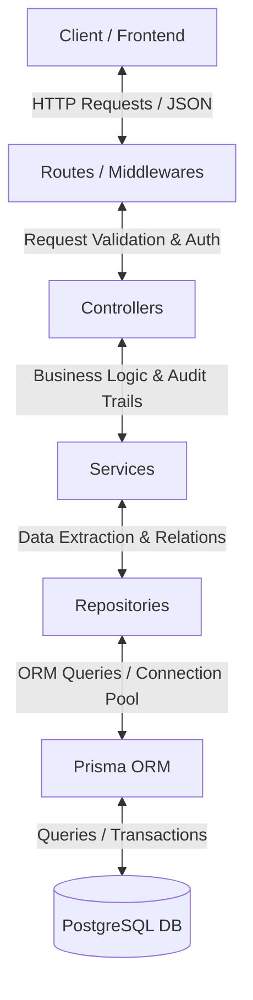
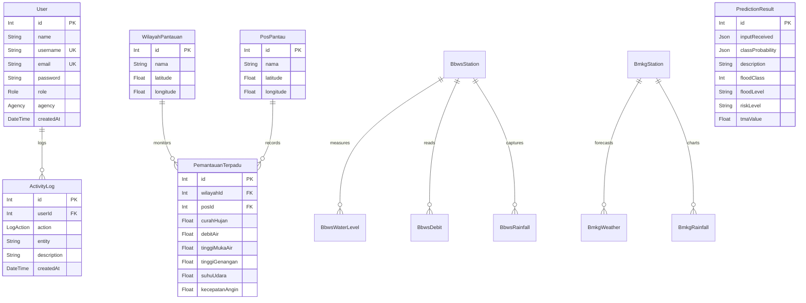

# 🌊 Si Citra Yang Banjir - Backend API

[](https://www.typescriptlang.org/)
[](https://nodejs.org/)
[](https://expressjs.com/)
[](https://www.prisma.io/)
[](https://www.postgresql.org/)

An enterprise-grade, highly scalable backend engine for **"Si Citra Yang Banjir"**, an integrated real-time Flood Warning & Monitoring System. This system aggregates real-time environmental metrics (rainfall, water levels, wind speed, etc.) from external bodies like **BBWS Citarum** and **BMKG**, provides robust prediction capabilities, maintains security audits, and delivers crucial early warning services to protect communities.

---

## 🏗️ System Architecture & Design Patterns

The project is architected around a strict **Controller-Service-Repository (CSR)** pattern to ensure clean separation of concerns, high modularity, and simplified unit testing:



### 1. Layers Overview
- **Routes Layer (`src/routes/`)**: Registers URL paths, maps HTTP methods, and applies middleware pipelines (e.g., rate limiting, authentication, error interception).
- **Controller Layer (`src/controllers/`)**: Manages HTTP responses/status codes, parses incoming parameters, and injects critical operations like **Activity Audit Logs**.
- **Service Layer (`src/services/`)**: Orchestrates the core business logic, coordinates transactions across multiple models, and performs mathematical validation.
- **Repository Layer (`src/repositories/`)**: Abstracts direct database queries. Completely isolates Prisma Client models and relations resolution from the upper layers.

### 2. Core Security & Audit Logs Pattern
- **Auth Middleware (`src/middlewares/authMiddleware.ts`)**: Validates Bearer tokens (JWT) and injects the parsed credentials payload into the Express Request lifecycle.
- **Modifying Operations Audit**: Every creation, modification, and deletion (POST, PUT, DELETE) on monitored assets auto-generates entries in the `ActivityLog` table. This tracks **who** modified **what** and **when** for secure accountability.

---

## 🗄️ Database Schema & Models

Below is the conceptual representation of the relational schema powered by PostgreSQL and Prisma ORM:



---

## 🚀 Key Features

1. **Integrated Flood Monitoring (Si Citra Yang Banjir)**:
   - Dynamic management of monitoring territories (`WilayahPantauan`) and physical observation stations (`PosPantau`).
   - Integrated measurements (`PemantauanTerpadu`) unifying rainfall, water levels (TMA), flood submergence, water discharges, and atmospheric metrics.
2. **Predictive Analytics Support**:
   - Captures neural network inputs, risk tiers (`SIAGA 1-4`, `AMAN`), probability matrices, and flood-level classifications via the `PredictionResult` API.
3. **Automated Sync Jobs**:
   - Integrates a reliable Background Sync Worker for scraping, cleaning, and syncing real-time hydrology stats directly from external source endpoints.
4. **Comprehensive Security Auditing**:
   - Automated JWT-based user authorization with granular privilege tiers (`SUPER_ADMIN`, `MASTER_ADMIN`, `ADMIN`).
   - Comprehensive operation logging for administrative accountability.

---

## 📡 API Endpoints Reference

> [!NOTE]
> All modifying actions (`POST`, `PUT`, `DELETE`) require a valid `Authorization: Bearer <JWT_TOKEN>` header.

### 1. Authentication & Users
| Endpoint | Method | Auth Required | Description |
| :--- | :---: | :---: | :--- |
| `/api/auth/register` | `POST` | No | Registers a new administrative user |
| `/api/auth/login` | `POST` | No | Validates credentials and returns JWT token |
| `/api/users/profile` | `GET` | Yes | Retrieves current user profile |

### 2. Wilayah Pantauan (Territories)
| Endpoint | Method | Auth Required | Description |
| :--- | :---: | :---: | :--- |
| `/api/wilayah-pantauan` | `GET` | No | Lists all monitoring territories |
| `/api/wilayah-pantauan/:id` | `GET` | No | Gets details of a specific territory |
| `/api/wilayah-pantauan` | `POST` | Yes | Creates a new monitoring territory 📝 |
| `/api/wilayah-pantauan/:id` | `PUT` | Yes | Updates territory attributes 📝 |
| `/api/wilayah-pantauan/:id` | `DELETE` | Yes | Deletes a territory 📝 |

### 3. Pos Pantau (Observation Posts)
| Endpoint | Method | Auth Required | Description |
| :--- | :---: | :---: | :--- |
| `/api/pos-pantau` | `GET` | No | Lists all physical observation posts |
| `/api/pos-pantau/:id` | `GET` | No | Gets details of a specific post |
| `/api/pos-pantau` | `POST` | Yes | Creates a new post 📝 |
| `/api/pos-pantau/:id` | `PUT` | Yes | Updates post attributes 📝 |
| `/api/pos-pantau/:id` | `DELETE` | Yes | Deletes a post 📝 |

### 4. Pemantauan Terpadu (Unified Observations)
| Endpoint | Method | Auth Required | Description |
| :--- | :---: | :---: | :--- |
| `/api/pemantauan-terpadu` | `GET` | No | Retrieves all unified observations (resolves Wilayah & Pos relationships) |
| `/api/pemantauan-terpadu/:id` | `GET` | No | Gets details of a specific observation |
| `/api/pemantauan-terpadu` | `POST` | Yes | Records new consolidated metrics 📝 |
| `/api/pemantauan-terpadu/:id` | `PUT` | Yes | Modifies existing observation values 📝 |
| `/api/pemantauan-terpadu/:id` | `DELETE` | Yes | Deletes an observation record 📝 |

### 5. Prediction Results (AI Forecasts)
| Endpoint | Method | Auth Required | Description |
| :--- | :---: | :---: | :--- |
| `/api/prediction-result` | `GET` | No | Lists all historical predictive output runs |
| `/api/prediction-result/:id` | `GET` | No | Gets details of a specific prediction |
| `/api/prediction-result` | `POST` | Yes | Logs a new AI/ML model inference run 📝 |
| `/api/prediction-result/:id` | `PUT` | Yes | Updates prediction description or metadata 📝 |
| `/api/prediction-result/:id` | `DELETE` | Yes | Deletes a historical prediction run 📝 |

### 6. Activity Logs (Audit Trails)
| Endpoint | Method | Auth Required | Description |
| :--- | :---: | :---: | :--- |
| `/api/activity-logs` | `GET` | Yes | Retrieves security audit logs (Super Admins/Admins) |

*📝 Note: Modifying operations automatically generate administrative audit logs (`ActivityLog`).*

---

## 🛠️ Local Setup & Installation

Follow these instructions to run the application in your local environment:

### 1. Prerequisites
Ensure you have the following installed:
- [Node.js](https://nodejs.org/) (version 18 or higher recommended)
- [PostgreSQL](https://www.postgresql.org/) database server running

### 2. Clone and Install Dependencies
Navigate to the root directory and install npm packages:
```bash
npm install
```

### 3. Configure Environment Variables
Create a `.env` file in the root directory based on the `.env.example` file:
```bash
cp .env.example .env
```
Open `.env` and configure your database URL and JWT parameters:
```env
# Database Credentials
DATABASE_URL="postgresql://<db_user>:<db_password>@localhost:5432/<db_name>?schema=public"

# Server Port
PORT=3001
NODE_ENV=development

# Authentication Secrets (Keep secure)
JWT_SECRET="generate-a-long-secure-random-string-here"
JWT_EXPIRE="7d"

# Background Sync Configurations
BBWS_SYNC_ENABLED=false
```

### 4. Sync Database Schema
Initialize your PostgreSQL database and synchronize with the Prisma Schema:
```bash
npx prisma db push
```

### 5. Start Development Server
Run the development environment using `nodemon` and auto hot-reloads:
```bash
npm run dev
```
The server will boot up and listen at **`http://localhost:3001`**.

---

## 🧪 Integration Testing Guide

We have developed a comprehensive end-to-end integration test suite located in `scripts/test-api.ts`. It performs automated calls against your running server to verify authorization, route responses, entity relationships, activity logging, and clean rollback.

### How to Execute Tests:
1. Ensure your local server is running by executing:
   ```bash
   npm run dev
   ```
2. In a separate terminal, execute the test suite script:
   ```bash
   npm run test:api
   ```

### Test Suite Lifecycle Coverage:
```
[Start Test Runner]
       │
       ▼
1. GET  /api/health (Checks DB and Server status)
       │
       ▼
2. POST /api/auth/register (Generates unique test account credentials)
       │
       ▼
3. POST /api/auth/login (Retrieves Bearer Auth JWT Token)
       │
       ▼
4. WilayahPantauan CRUD (POST -> GET List -> PUT Update -> ActivityLog verification)
       │
       ▼
5. PosPantau CRUD (POST -> GET List -> PUT Update -> ActivityLog verification)
       │
       ▼
6. PemantauanTerpadu CRUD (POST -> GET List -> Validate relationships loading)
       │
       ▼
7. PredictionResult CRUD (POST -> GET List -> PUT Update)
       │
       ▼
8. Rollback Cleanup (DELETE entities in correct dependent sequence)
       │
       ▼
[Completed Successfully 🎉]
```

---

## 🛡️ Code Quality & Technical Standard
- **Strong Typing**: Avoids implicit `any` definitions. Standardized interface signatures reside in `src/types/index.ts`.
- **Relational Integrity**: Model relationships resolved inside repositories to keep controllers clean of query mechanics.
- **Graceful Interception**: Built-in SIGTERM interceptor to safely shutdown database connection pools and end cron workers cleanly.
